# AIDP Copilot Mode Flow

This document describes the complete flow when a user starts AIDP in copilot mode, from initialization through the interactive planning conversation to the start of the work loop.

## Flow Diagram

```mermaid
flowchart TD
    A[User runs `aidp`] --> B["CLI.run called<br/><i>Aidp::CLI.run(ARGV)</i>"]
    B --> C{"Check for subcommands<br/><i>CLI.subcommand?(args)</i>"}
    C -->|Has subcommand| D["Run subcommand<br/><i>CLI.run_subcommand</i>"]
    C -->|No subcommand| E["Parse CLI options<br/><i>CLI.parse_options</i>"]
    
    E --> F{Setup/help flags?}
    F -->|--help| G[Show help & exit]
    F -->|--version| H[Show version & exit]
    F -->|--setup-config| I["Force config setup<br/><i>FirstRunWizard.setup_config</i>"]
    F -->|No flags| J["Setup logging<br/><i>CLI.setup_logging</i>"]
    
    I --> K["FirstRunWizard.setup_config<br/><i>CLI::FirstRunWizard.setup_config</i>"]
    J --> L{"Config exists?<br/><i>Config.config_exists?</i>"}
    L -->|No| M["FirstRunWizard.ensure_config<br/><i>CLI::FirstRunWizard.ensure_config</i>"]
    L -->|Yes| N[Config validated]
    
    M --> K
    K --> O{Setup successful?}
    O -->|No| P[Exit with error]
    O -->|Yes| N
    
    N --> Q[Initialize TUI components]
    Q --> R["EnhancedTUI.new<br/><i>Harness::UI::EnhancedTUI.new</i>"]
    R --> S["EnhancedWorkflowSelector.new<br/><i>Harness::UI::EnhancedWorkflowSelector.new</i>"]
    S --> T["Start TUI display loop<br/><i>tui.start_display_loop</i>"]
    
    T --> U[Mode = :guided]
    U --> V["workflow_selector.select_workflow<br/><i>EnhancedWorkflowSelector#select_workflow</i>"]
    V --> W["GuidedAgent.select_workflow<br/><i>Workflows::GuidedAgent#select_workflow</i>"]
    
    W --> X["Welcome message<br/><i>display_message</i>"]
    X --> Y["Validate provider config<br/><i>GuidedAgent#validate_provider_configuration!</i>"]
    Y --> Z{Provider available?}
    Z -->|No| AA[Show provider error]
    Z -->|Yes| BB["Plan Phase begins<br/><i>GuidedAgent#plan_and_execute_workflow</i>"]
    
    BB --> CC["Ask user goal<br/><i>GuidedAgent#user_goal</i>"]
    CC --> DD["User enters goal<br/><i>@prompt.ask</i>"]
    DD --> EE["Start iterative planning<br/><i>GuidedAgent#iterative_planning</i>"]
    
    EE --> FF["AI asks clarifying questions<br/><i>GuidedAgent#get_planning_questions</i>"]
    FF --> GG["User answers questions<br/><i>@prompt.ask</i>"]
    GG --> HH["Update plan with answers<br/><i>plan data structure updated</i>"]
    HH --> II{Plan complete?}
    
    II -->|No| FF
    II -->|Yes| JJ["Display plan summary<br/><i>GuidedAgent#display_plan_summary</i>"]
    JJ --> KK{"User approves plan?<br/><i>@prompt.yes?</i>"}
    KK -->|No| FF
    KK -->|Yes| LL["Identify needed steps<br/><i>GuidedAgent#identify_steps_from_plan</i>"]
    
    LL --> MM["Generate planning documents<br/><i>GuidedAgent#generate_documents_from_plan</i>"]
    MM --> NN["Build workflow config<br/><i>GuidedAgent#build_workflow_from_plan</i>"]
    NN --> OO[Return to workflow selector]
    
    OO --> PP["Create EnhancedRunner<br/><i>Harness::EnhancedRunner.new</i>"]
    PP --> QQ["Start harness execution<br/><i>EnhancedRunner#run</i>"]
    QQ --> RR["Show workflow status<br/><i>EnhancedRunner#show_workflow_status</i>"]
    RR --> SS["Enter main execution loop<br/><i>EnhancedRunner#run loop</i>"]
    
    SS --> TT["Get next step<br/><i>EnhancedRunner#get_next_step</i>"]
    TT --> UU{Step available?}
    UU -->|No| VV[Workflow complete]
    UU -->|Yes| WW["Execute step with TUI<br/><i>EnhancedRunner#execute_step_with_enhanced_tui</i>"]
    
    WW --> XX["Update progress display<br/><i>ProgressDisplay#update</i>"]
    XX --> YY["Check for pause/stop<br/><i>EnhancedRunner#should_pause?</i>"]
    YY --> ZZ{Should continue?}
    ZZ -->|Yes| TT
    ZZ -->|No| AAA["Handle pause/stop<br/><i>EnhancedRunner#handle_pause_condition</i>"]
    
    VV --> BBB[Show completion status]
    BBB --> CCC["Stop TUI display loop<br/><i>tui.stop_display_loop</i>"]
    CCC --> DDD[Exit with status code]
    
    AAA --> CCC

    %% Styling
    classDef userAction fill:#e1f5fe
    classDef aiAction fill:#f3e5f5
    classDef systemAction fill:#e8f5e8
    classDef decision fill:#fff3e0
    
    class CC,DD,GG,KK userAction
    class FF,LL,MM aiAction
    class A,B,Q,R,S,T,PP,QQ,WW,XX systemAction
    class C,F,L,O,Z,II,UU,YY,ZZ decision
```

## Key Phases

### 1. Startup & Configuration

- CLI initialization and option parsing
- Configuration validation and setup wizard if needed
- Logging setup from aidp.yml

### 2. TUI Initialization

- Enhanced UI components are created
- Display loop starts for real-time updates
- Workflow selector is initialized

### 3. Guided Workflow Selection

- Mode is set to `:guided` by default (copilot mode)
- `GuidedAgent` takes over user interaction
- Provider configuration is validated

### 4. Iterative Planning

- User is asked for their goal with examples
- AI asks clarifying questions in a loop
- Plan is built incrementally from user responses
- Process continues until plan is complete and user approves

### 5. Workflow Creation

- Needed execution steps are identified from the plan
- Planning documents are generated
- Workflow configuration is built and returned

### 6. Work Loop Start

- `EnhancedRunner` takes the workflow configuration
- Main execution loop begins with step-by-step processing
- Progress is displayed in real-time via TUI

## Key Classes Involved

- **`Aidp::CLI`**: Entry point and main orchestration
- **`Aidp::CLI::FirstRunWizard`**: Configuration setup
- **`Aidp::Harness::UI::EnhancedTUI`**: Terminal UI management
- **`Aidp::Harness::UI::EnhancedWorkflowSelector`**: Workflow selection logic
- **`Aidp::Workflows::GuidedAgent`**: AI-powered planning conversation
- **`Aidp::Harness::EnhancedRunner`**: Workflow execution engine

## User Interaction Points

1. **Initial Goal**: User describes what they want to accomplish
2. **Planning Questions**: AI asks follow-up questions to clarify scope, requirements, constraints
3. **Plan Approval**: User reviews and approves the generated plan
4. **Execution Monitoring**: User can pause/stop during execution

## File Locations

- CLI entry: `bin/aidp` → `lib/aidp/cli.rb`
- Guided agent: `lib/aidp/workflows/guided_agent.rb`
- Enhanced runner: `lib/aidp/harness/enhanced_runner.rb`
- TUI components: `lib/aidp/harness/ui/`
- First run wizard: `lib/aidp/cli/first_run_wizard.rb`

The flow emphasizes the conversational, iterative nature of copilot mode where AI helps users refine their goals through questions before any actual work begins.
