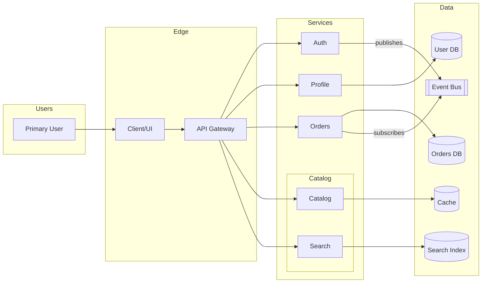

# Mermaid C4 Diagram Template

```mermaid
flowchart LR
  subgraph Users
    U[Primary User]
  end

  subgraph Edge
    FE[Client/UI]
    API[API Gateway]
  end

  subgraph Services
    Auth[Auth]
    Profile[Profile]
    Orders[Orders]
    subgraph Catalog
      Cat[Catalog]
      Search[Search]
    end
  end

  subgraph Data
    UDB[(User DB)]
    ODB[(Orders DB)]
    IDX[(Search Index)]
    CACHE[(Cache)]
    BUS[[Event Bus]]
  end

  U --> FE --> API
  API --> Auth
  API --> Profile
  API --> Orders
  API --> Cat
  API --> Search

  Profile --> UDB
  Orders --> ODB
  Search --> IDX
  Cat --> CACHE

  Auth -- publishes --> BUS
  Orders -- subscribes --> BUS
```
