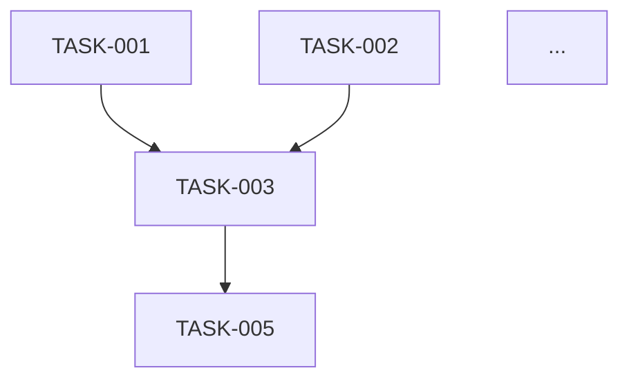

# Generate Detailed Task List

You are creating a comprehensive task list with dependencies, effort estimates, and acceptance criteria.

## Input

Read:
- `.aidp/docs/WBS.md` - Work breakdown structure
- `.aidp/docs/PRD.md` - Requirements for success criteria

## Your Task

Create a detailed, actionable task list suitable for execution.

## Task List Format

```markdown
# Project Task List

Generated: <timestamp>

## Tasks by Phase

### Phase: Requirements

#### TASK-001: Document Functional Requirements
- **Description**: Extract and document all functional requirements from PRD
- **Effort**: 3 story points
- **Phase**: Requirements
- **Dependencies**: None
- **Assigned To**: (Will be assigned in persona mapping step)
- **Acceptance Criteria**:
  - [ ] All functional requirements documented
  - [ ] Requirements reviewed by stakeholders
  - [ ] Requirements traceable to PRD

#### TASK-002: Document Non-Functional Requirements
...

### Phase: Design
...

## Dependency Graph



## Summary

- **Total Tasks**: X
- **Total Effort**: Y story points
- **Estimated Duration**: Z weeks
```

## Task Attributes

Each task must have:
- Unique ID (TASK-###)
- Clear description
- Effort estimate
- Phase
- Dependencies (task IDs it depends on)
- Acceptance criteria (checkboxes)

## Guidelines

- Tasks should be atomic and actionable
- Dependencies must be accurate
- Acceptance criteria must be measurable
- Effort estimates should be realistic

## Output

Write detailed task list to `.aidp/docs/TASK_LIST.md`
